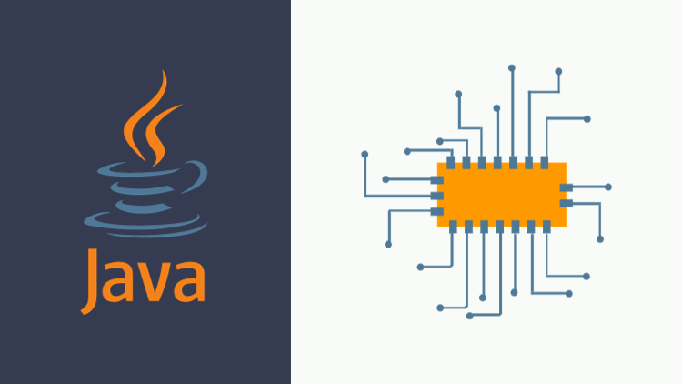

# Java 21 - Virtual Thread MasterClass

This repoistory contains the source code for my [**Java Virtual Thread**](https://www.udemy.com/course/java-virtual-thread/) course on Udemy.

Dive deep into the intricacies of concurrency & Learn how to make your Java applications run smoother and faster using simple and effective concurrency techniques. From the basics to hands-on projects, this course equips you with the skills to revolutionize your approach to programming.

## Course Highlights:

- **Understanding Concurrency**: Learn about the challenges of traditional threads and discover how Java Virtual Threads provide a simpler and more efficient solution for making your programs scale seamlessly.

- **Executor Service Mastery**: Dive into using Executor Service with Virtual Threads. Overcome challenges, control concurrency, and process tasks more efficiently by breaking them down into parallel subtasks.

- **Completable Future Exploration**: Explore Completable Future for asynchronous task processing with Virtual Threads. Learn practical methods, handle timeouts, and manage errors in a declarative style.

- **Preview of Structured Concurrency**: Get a sneak peek into Java's new preview APIs, giving you insights into the future of concurrent programming. Stay ahead of the curve with a simplified understanding of Java's concurrency development.

- **Practical Application Development**: Apply what you've learned in a hands-on project using Spring Boot Web and Virtual Threads. See firsthand how these concepts integrate seamlessly into real-world application development.

- **Scalability Testing with JMeter**: Test your application's scalability using JMeter. Compare throughput and response time to ensure optimal efficiency under different conditions.

- **Migration Made Easy**: Conclude the course with a practical migration guide to transition your existing applications to Java Virtual Threads effortlessly. Get ready for a future where your programs effortlessly combine concurrency and scalability.

Unlock the full potential of Java Virtual Threads and elevate your programming skills. Enroll now to reshape the way you approach scalability and performance in Java applications!